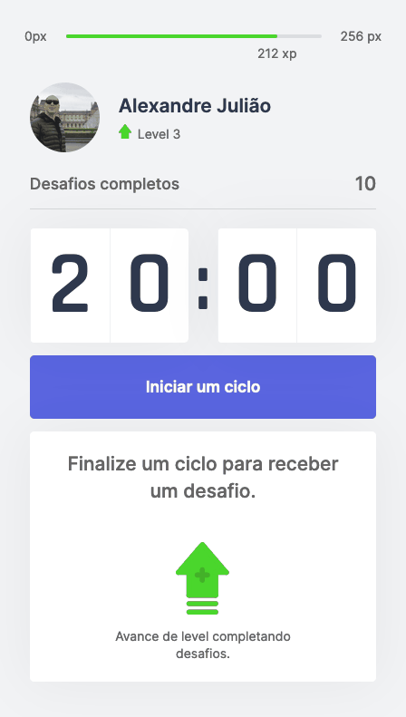
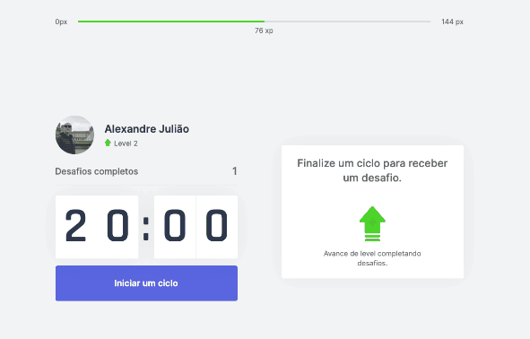

<p align="center">
	

  

  

  <a href="https://github.com/alejuliao">
    
  </a>
</p>

<h1 align="center">
  Move.it
</h1>
<h3 align="center">
	NLW: Next Level Week - (React + NextJs + Typescript + CSS)
</h3>
<h4 align="center">
	Acesse a demo:
	<a href="https://pomodoro-next-nlw.vercel.app">
		Move.it
	</a>
</h4>

## 💻 Sobre o projeto

[Moveit](https://pomodoro-next-nlw.vercel.app) - é uma aplicação que permite você executar a técnica de Pomodoro para focar nas suas atividades. Ao final de cada ciclo, um desafio lhe é proposto para que você descanse e se exercite.

Projeto desenvolvido durante a **NLW - Next Level Week 4** oferecida pela [Rocketseat](https://nextlevelweek.com/), realizada com o framework React.js e Next.js, além de outras tecnologias front end.

---

## ⚙️ Funcionalidades

- [x] Contagem regressiva de 20 minutos
- [x] Desafio para exercitar seu corpo e olhos

---

## 🎨 Layout

### Mobile

<p align="center">
  
</p>

### Web

<p align="center" style="display: flex; align-items: flex-start; justify-content: center;">
  
</p>

---

## 🚀 Como executar o projeto

### Pré-requisitos

Antes de começar, você vai precisar ter instalado em sua máquina as seguintes ferramentas:
[Git](https://git-scm.com), [Node.js](https://nodejs.org/en/).
Além disto é bom ter um editor para trabalhar com o código como [VSCode](https://code.visualstudio.com/)

#### 🧭 Rodando a aplicação

```bash

# Clone este repositório
$ git clone git@github.com:alejuliao/pomodoro-next.git

# Acesse a pasta do projeto no seu terminal/cmd
$ cd pomodoro-next

# Instale as dependências (escolha um)
$ npm install
$ yarn install

# Execute a aplicação em modo de desenvolvimento (escolha um)
$ npm run dev
$ yarn dev

# A aplicação será aberta na porta:3000
# acesse http://localhost:3000

```

---

## 🛠 Tecnologias

As seguintes ferramentas foram usadas na construção do projeto:

#### **Website** ([React](https://reactjs.org/) + [Next](https://nextjs.org/) + [TypeScript](https://www.typescriptlang.org/) + [CSS](https://www.w3.org/Style/CSS/#specs))

<br>

> Veja o arquivo [package.json](https://github.com/alejuliao/pomodoro-next/blob/main/package.json)

---

## Autor

<a href="https://github.com/alejuliao">
 
 <br />
 <sub><b>Alexandre Julião</b></sub>
</a>
<br />

[](https://www.linkedin.com/in/alexandrejuliao/)

---

## 📝 Licença

Este projeto esta sobe a licença [MIT](./LICENSE).

Feito com ❤️ por Alexandre Julião 👋🏽 [Entre em contato!](https://www.linkedin.com/in/alexandrejuliao/)
